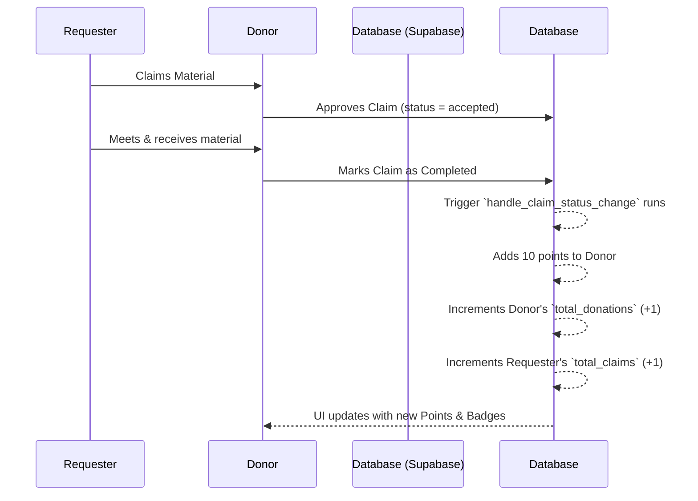
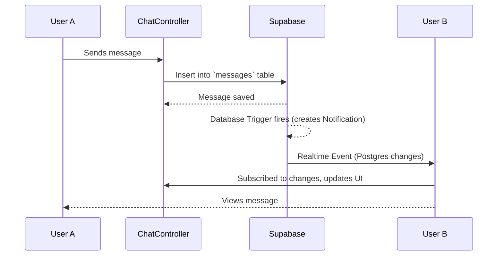
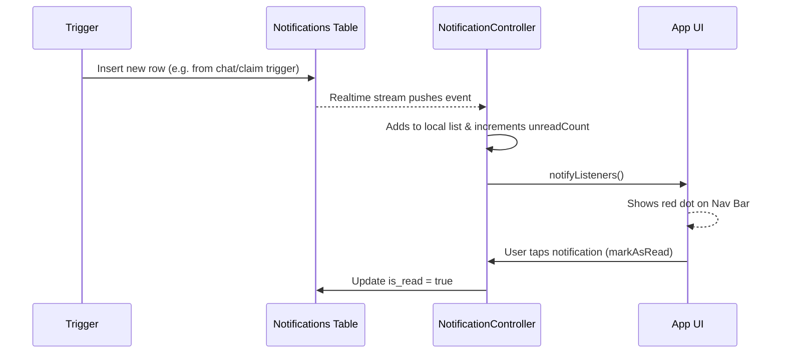
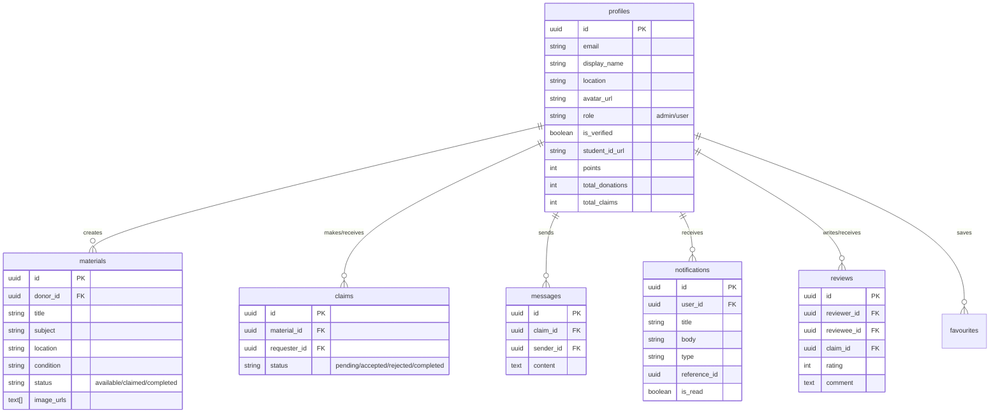

# Boipao - Student Academic Material Sharing Platform


Boipao is a localized, student-centric academic material sharing application. It enables students to easily donate, exchange, and claim educational materials such as books, test papers, and notes within their local communities. To encourage active participation, Boipao incorporates a gamification system where users earn points, badges, and reputation through successful material donations and positive reviews.

## 🚀 Features

* **Authentication & Profiles:** Secure email/password login, customizable profiles, and an Admin verification system for student IDs.
* **Listings & Search:** Browse recent and featured listings, search by title, and filter by subject/condition.
* **Material Claims & Chat:** Request materials from donors and communicate in real-time through an integrated chat system.
* **Real-time Notifications:** Get instantly notified when someone requests your material, accepts your claim, or sends you a message.
* **Gamification:** Earn points for donating materials. Unlock badges (e.g., "First Donation", "Elite Donor") based on your contribution count and points.
* **Reviews & Ratings:** Leave feedback for donors after a successful exchange to build a trustworthy community.
* **Favourites:** Save materials you're interested in for later viewing.

---

## 📂 Project File Structure

```
lib/
├── assets/                  # App images and static assets
├── controllers/             # State management and business logic (Providers)
│   ├── admin_controller.dart
│   ├── auth_controller.dart
│   ├── chat_controller.dart
│   ├── claim_controller.dart
│   ├── main_controller.dart
│   ├── material_controller.dart
│   ├── notification_controller.dart
│   ├── review_controller.dart
│   └── verification_controller.dart
├── core/
│   └── theme/               # Global Neumorphic design system (AppColors)
├── models/                  # Data models mapping to Supabase tables
│   ├── favourite_model.dart
│   ├── material_model.dart
│   ├── message_model.dart
│   ├── notification_model.dart
│   ├── review_model.dart
│   └── user_model.dart
├── views/                   # UI Screens organized by feature
│   ├── admin/               # Admin dashboard for verifying IDs
│   ├── auth/                # Login and Signup views
│   ├── chat/                # Inbox and Chat views
│   ├── home/                # Main home feed
│   ├── listings/            # Creating, editing, and viewing materials
│   ├── main/                # Main scaffold (Navigation bar) & Search
│   ├── notifications/       # Notifications feed
│   └── profile/             # Profile, Badges, Claims, Favourites
└── widgets/                 # Reusable UI components (NeuCards, NavBars, Dialogs)
```

---

## 🔄 Feature Flow Diagrams

### 1. Gamification Flow


### 2. Chat & Messaging Flow


### 3. Notification Flow


---

## 🗄️ Database Schema



---

## 🛠️ How to Run

### Prerequisites
* Flutter SDK (3.10.4 or higher)
* Dart SDK
* A Supabase project with the correct database schema applied (found in `dbschema.sql`).

### Setup Instructions
1. **Clone the repository:**
   ```bash
   git clone <repository-url>
   cd boipao
   ```
2. **Install Dependencies:**
   ```bash
   flutter pub get
   ```
3. **Configure Supabase:**
   * Open `lib/main.dart` and locate the `Supabase.initialize` block.
   * Replace the `url` and `anonKey` with your actual Supabase project credentials.
4. **Run the app:**
   ```bash
   flutter run
   ```

---

## 📄 License

This project is licensed under the MIT License - see the LICENSE section below for details.

### MIT License

Copyright (c) 2024 Boipao

Permission is hereby granted, free of charge, to any person obtaining a copy
of this software and associated documentation files (the "Software"), to deal
in the Software without restriction, including without limitation the rights
to use, copy, modify, merge, publish, distribute, sublicense, and/or sell
copies of the Software, and to permit persons to whom the Software is
furnished to do so, subject to the following conditions:

The above copyright notice and this permission notice shall be included in all
copies or substantial portions of the Software.

THE SOFTWARE IS PROVIDED "AS IS", WITHOUT WARRANTY OF ANY KIND, EXPRESS OR
IMPLIED, INCLUDING BUT NOT LIMITED TO THE WARRANTIES OF MERCHANTABILITY,
FITNESS FOR A PARTICULAR PURPOSE AND NONINFRINGEMENT. IN NO EVENT SHALL THE
AUTHORS OR COPYRIGHT HOLDERS BE LIABLE FOR ANY CLAIM, DAMAGES OR OTHER
LIABILITY, WHETHER IN AN ACTION OF CONTRACT, TORT OR OTHERWISE, ARISING FROM,
OUT OF OR IN CONNECTION WITH THE SOFTWARE OR THE USE OR OTHER DEALINGS IN THE
SOFTWARE.
